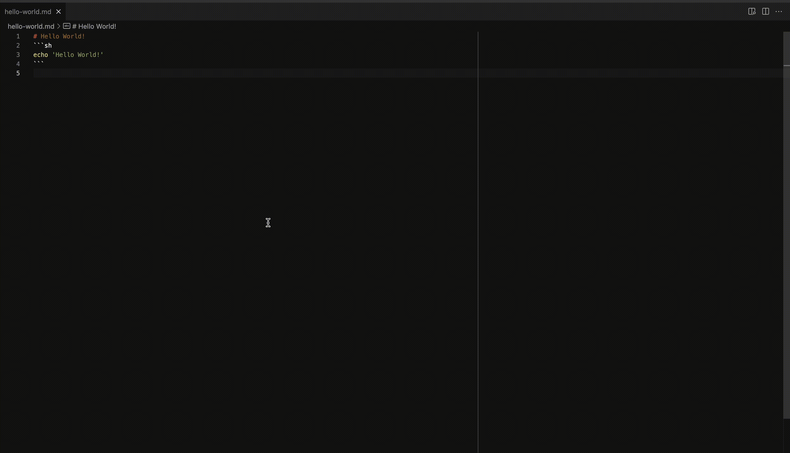
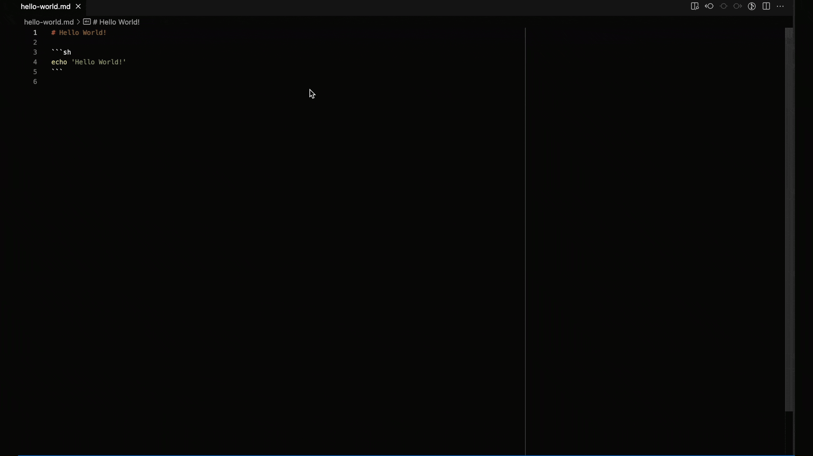

# Tothom

Tothom is YAMP (_Yet Another Markdown Preview_) [Visual Studio Code extension](https://marketplace.visualstudio.com/items?itemName=guicassolato.tothom),
that gives you nice <kbd>▶️</kbd> _Run in terminal_ buttons for your code blocks

## Features

- Markdown preview (<kbd>⇧ ⌘ P</kbd></kbd> _Tothom: Markdown Preview_)
- <kbd>▶️</kbd> _Run in terminal_ actions for code blocks (auto-generated)
- Alternative to run code blocks in a separate shell in the background (output appended to the preview)
- GitHub styling
- Syntax highlight for code blocks
- Dark/light mode
- ANSI escape sequences to HTML (for code block output appended to the preview)
- Follow links between local markdown files
- Anchor links
- Tasks/TODO lists (with [markdown-it-task-lists](https://www.npmjs.com/package/markdown-it-task-lists))
- HTML tag attributes (with [markdown-it-attrs](https://www.npmjs.com/package/markdown-it-attrs))
- Automatic reload of the preview on edit of the source markdown file
- Independent preview tabs for each markdown file
- Force preview reload (<kbd>⇧ ⌘ P</kbd></kbd> _Tothom: Reload Preview_)
- Bind an existing terminal to a preview (a dedicated one is automatically created otherwise)
- Native VSCode _Find_ widget enabled in the preview

## Usage



1. Open a markdown file that contains code blocks annotated in any of the supported languages (bash/sh/zsh), e.g.:
   <pre>
   # Hello World!
   ```sh
   echo 'Hello World!'
   ```
   </pre>
2. Run the **_Tothom: Markdown Preview_** command (<kbd>⇧ ⌘ P</kbd>)
3. Click on the <kbd>▶️</kbd> button automatically rendered with each of your code blocks, to run the code in the Visual Studio Code terminal.

For more examples with more markdown syntax, check the [samples](samples/tothom.md).

### Re-use a terminal

Tothom binds each preview window to an integrated Visual Studio terminal.
When a terminal does not exist, Tothom creates a dedicated one at the time when the first <kbd>▶️</kbd> _Run in terminal_ action is executed.

To bind a new preview window to an existing terminal, use the command <kbd>⇧ ⌘ P</kbd> _Tothom: Markdown Preview (existing terminal)_.

To re-bind a preview window to an existing terminal, activate the preview and execute the command <kbd>⇧ ⌘ P</kbd> _Tothom: Select terminal_.

These options allow to share a terminal across multiple preview windows.

To clear the current binding of a preview to a terminal, activate the preview window and execute the command <kbd>⇧ ⌘ P</kbd> _Tothom: Clear terminal selection_.

### Run in a separate shell in the background (output appended to the preview)

Alternatively to running a code block in an integrated Visual Studio terminal, enable the option in the settings to default to running in a separate shell in the background (`tothom.runInBackgroundByDefault`).
New preview windows and preview windows not yet bound to a terminal will execute code blocks in the background and the output of the executions appended to the preview window.



Keep in mind that, with this option enabled, each execution of a code block will run in an independent shell (separate child process).
To set and re-use environment variable values across multiple code blocks, enable the `tothom.propagateEnv` configuration option.

This option is ignored if the preview is currently bound to a terminal (e.g. by using the 'Select terminal' command).
If needed, clear the current binding of a preview to a terminal after enabling this option by activating the preview window and executing the command <kbd>⇧ ⌘ P</kbd> _Tothom: Clear terminal selection_.

## Extension Settings

| Setting                           | Description                                                                                                      | Options/Default                   |
|-----------------------------------|------------------------------------------------------------------------------------------------------------------|-----------------------------------|
| `tothom.bracketedPasteMode`       | Apply bracketed paste sequences on commands sent to terminal                                                     | `true` (default), `false`         |
| `tothom.colorScheme`              | Color scheme of the preview panel                                                                                | `auto` (default), `light`, `dark` |
| `tothom.runInTerminalLabel`       | Label of the _Run in terminal_ button                                                                            | Default: `▶️`                      |
| `tothom.runInBackgroundByDefault` | Default to running code blocks in a separate child process in the background instead of the integrated terminal  | `true`, `false` (default)         |
| `tothom.propagateEnv`             | Propagates environment variables across executions when running code blocks in separate shells in the background | `true` (default), `false`         |

## Limitations

**Markdown syntax for code blocks only**<br/>
Code block execution only works with markdown code block syntax (delimited by ```).
Tothom will not render the <kbd>▶️</kbd> _Run in terminal_ button for code blocks written using HTML syntax (`<pre>`).

## Release Notes

Check the the full release notes in the [Change Log](./CHANGELOG.md).
